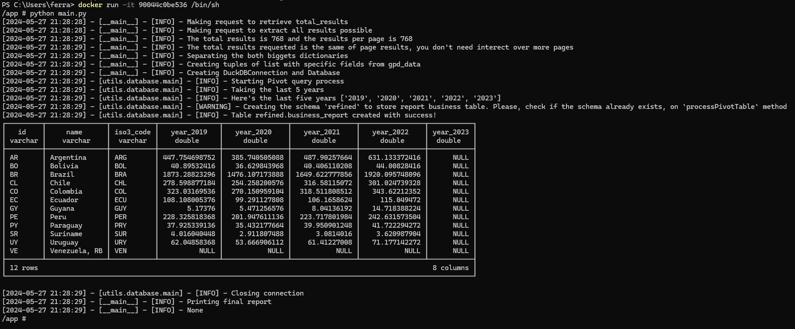

# duckDB-Lab

## Goal

The objective of this test is to develop a data ingestion pipeline using Python, which will:

* **Extract** data on the Gross Domestic Product (GDP) of South American countries using the World Bank API:
  * Endpoint: `https://api.worldbank.org/v2/country/ARG;BOL;BRA;CHL;COL;ECU;GUY;PRY;PER;SUR;URY;VEN/indicator/NY.GDP.MKTP.CD?format=json&page=1&per_page=50`

* **Load** this data into a SQL database of your choice (such as PostgreSQL, SQLite, DuckDB, Trino, etc.):
  * Create `country` (id, name, iso3_code) and `gdp` (country_id, year, value) tables.
  * Additional structures or control columns may be implemented as needed.

* **Query** the loaded data to produce a pivoted report of the last 5 years for each country, presented in Billions:
  * Expected query structure:

    | id | name     | iso3_code | 2019 | 2020 | 2021 | 2022 | 2023 |
    |----|----------|-----------|------|------|------|------|------|


## Project Structure
```
.
├── .github
│ └── workflows
│ ├── dev-ci_cd.yaml
│ └── prd-ci_cd.yaml
├── laboratoryDuckDB
│ ├── Include
│ ├── Lib
│ ├── Scripts
│ ├── share
│ └── src
│ └── pyvenv.cfg
├── readme_assets
│ ├── docker_images_check.png
│ ├── docker_pull_image.png
│ └── etl_execution.png
├── utils
│ ├── database
│ │ ├── pycache
│ │ ├── adhoc_database.ipynb
│ │ └── main.py
│ ├── logs
│ │ ├── pycache
│ │ ├── init.py
│ │ └── main.py
├── .gitignore
├── database_data.duckdb
├── Dockerfile
├── main.py
├── Pipfile
├── Pipfile.lock
├── README.md
└── requirements.txt
```


## Description

This project utilizes DuckDB to manage and analyze data. The project structure is organized as follows:

- `.github/workflows`: Contains GitHub Actions workflows for CI/CD.
  - `dev-ci_cd.yaml`: Deploys the Docker image to the development Docker registry.
  - `prd-ci_cd.yaml`: Deploys the Docker image to the production Docker registry. The production deployment only occurs on push to the `main` branch, while the development deployment occurs on any branch that is not `main` or starts with `feature/*`.

- `laboratoryDuckDB`: Contains the environment and necessary files for DuckDB.
  - `Include`, `Lib`, `Scripts`, `share`, `src`: These directories include various files and configurations for the DuckDB environment.
  - `pyvenv.cfg`: Python virtual environment configuration file.

- `readme_assets`: Contains assets for the README.
  - `docker_images_check.png`, `docker_pull_image.png`, `etl_execution.png`: Images to illustrate the Docker image checks and ETL execution.

- `utils`: Utility scripts and modules.
  - `database`: Contains database-related scripts.
    - `adhoc_database.ipynb`: Jupyter notebook for ad-hoc database analysis.
    - `main.py`: Main script for database operations.
  - `logs`: Contains logging-related scripts.
    - `__init__.py`: Initialization script for logs module.
    - `main.py`: Main script for logging operations.

- `.gitignore`: Specifies files and directories to be ignored by git.
- `database_data.duckdb`: DuckDB database file.
- `Dockerfile`: Docker configuration file for building the project image.
- `main.py`: Main entry point for the project.
- `Pipfile` and `Pipfile.lock`: Pipenv files for managing Python dependencies.
- `README.md`: Project documentation.
- `requirements.txt`: Python dependencies list.

## How to Run: Locally

### Prerequisites

- Docker
- Python 3.9+
- Pipenv (for dependency management)

### Setup

1. **Clone the repository:**
   ```bash
   git clone https://github.com/felipeleonardo98/laboratoryDuckDB.git
   cd laboratoryDuckDB

2. **Set up the Python environment:**
   ```bash
    pipenv install
    pipenv shell

3. **Build the Docker image:**
   ```bash
   docker build -t laboratory-duckdb:latest .

4. **Run the Docker container::**
   ```bash
   docker run -d --name laboratory-duckdb-container laboratory-duckdb:latest .

Also, you can run "python main.py" inside container or without create one.

## GitHub Actions CI/CD

### Development Deployment

The `dev-ci_cd.yaml` file is configured to deploy the Docker image to the development Docker registry. This deployment occurs on any branch except `main` or branches starting with `feature/*`.

### Production Deployment

The `prd-ci_cd.yaml` file is configured to deploy the Docker image to the production Docker registry. This deployment occurs only when there is a push to the `main` branch.

## Accessing Production

1. **Access the Docker Hub**: Go to [felipeleonardo Docker Hub](https://hub.docker.com/repositories/felipeleonardo) and find the repositories: `prd-lab-duckdb` or `dev-lab-duckdb`.

2. **Pull the Desired Image**: Execute the following command to pull the desired image from Docker Hub.

    

    ```sh
    docker pull felipeleonardo/prd-lab-duckdb:{image_tag_commit_hash_here}
    # or for the development image
    docker pull felipeleonardo/dev-lab-duckdb:{image_tag_commit_hash_here}
    ```

3. **Check if the Image is on Your Local Machine**: Verify that the image has been successfully pulled and is available on your local machine.

    

    ```sh
    docker images
    ```

4. **Test the Script**: Now you can run the script by following these commands:

    

    ```sh
    docker run -it {image_id} /bin/sh/
    ```

    After running the container, you can execute your ETL script as follows:

    ```sh
     python main.py
    ```


## Assets

Included in the `readme_assets` directory are images that illustrate Docker image checks and ETL execution processes:

- `docker_images_check.png`
- `docker_pull_image.png`
- `etl_execution.png`


## License

This project is licensed under the MIT License. See the [LICENSE](LICENSE) file for details.

